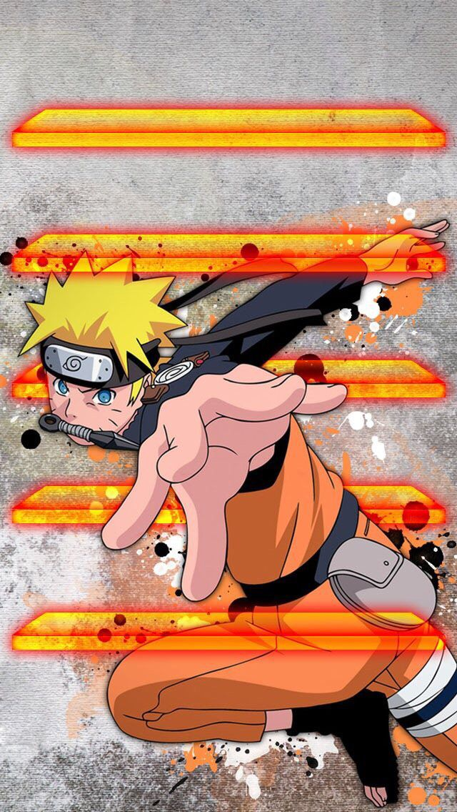

# Pygame-Naruto-Shippuden

<h2>🍥 Descripción</h2>
Pygame Naruto-Shippuden es un pequeño videojuego desarrollado en Python utilizando la librería PyGame, en el que el jugador debe hacer clic sobre enemigos que aparecen en pantalla para sumar puntos dentro de un tiempo límite.
El objetivo es simple: lograr la mayor cantidad de puntos en 60 segundos, poniendo a prueba la velocidad de reacción y precisión del jugador.

<h2>🎯 Objetivo del proyecto</h2>

Este proyecto nace como una iniciativa personal luego de cursar Programación I, con la intención de:

Reforzar conceptos fundamentales de programación
<ul>
  <li>Aplicar buenas prácticas vistas en la materia</li>
  <li>Llevar la teoría a un proyecto real</li>
  <li>Experimentar con desarrollo de videojuegos</li>
</ul>

Aunque no era obligatorio para aprobar la materia, decidí desarrollarlo por cuenta propia como desafío personal y para profundizar mi aprendizaje.

<h2>🕹️ ¿Cómo se juega?</h2>
<ul>
  <li>Aparecen enemigos en pantalla de forma dinámica</li>
  <li>El jugador debe hacer clic sobre ellos para eliminarlos</li>
  <li>Cada enemigo eliminado suma puntos</li>
  <li>El juego tiene una duración de 60 segundos</li>
  <li>Al finalizar el tiempo:</li>
    <ul>
      <li>Se guarda la puntuación</li>
      <li>Se muestra un ranking de jugadores ordenado de mayor a menor puntaje</li>
    </ul>
</ul>

<h2>🧠 Conceptos aplicados</h2>

Durante el desarrollo se aplicaron diversos conceptos clave de programación:

<ul>
  <li>Uso de funciones para modularizar el código</li>
  <li>Implementación de diccionarios y sets</li>
  <li>Uso de bucles (loops) para la lógica del juego</li>
  <li>Manejo de eventos (inputs del mouse)</li>
  <li>Lectura y escritura de archivos</li>
  <li>Uso de JSON para persistencia de datos (ranking de puntajes)</li>
  <li>Ordenamiento de datos (ranking descendente)</li>
  <li>Separación de responsabilidades (organización del código)</li>
  <li>Manejo de audio en PyGame (música por pantalla)</li>
  <li>Uso de la librería PyGame para gráficos y lógica del juego</li>
</ul>

<h2>🛠️ Tecnologías utilizadas</h2>

<ul>
  <li>Python 🐍</li>
  <li>PyGame 🎮</li>
  <li>JSON 📄</li>
</ul>
